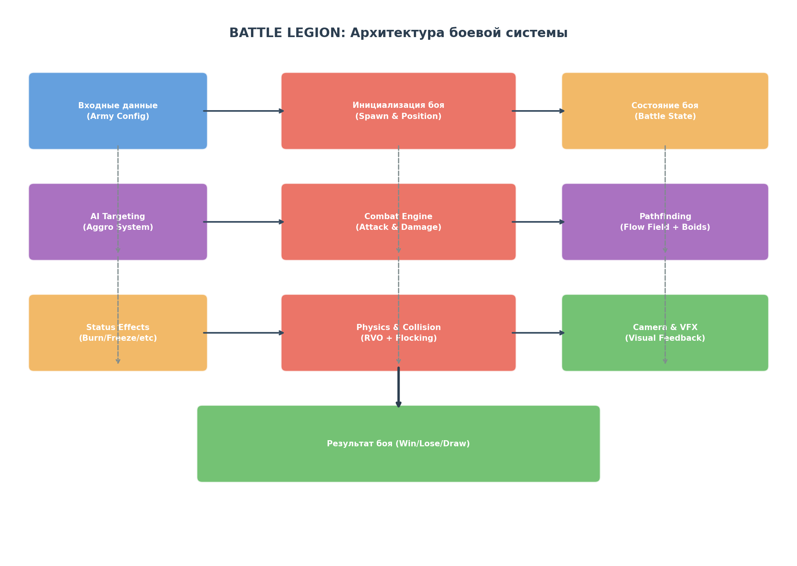
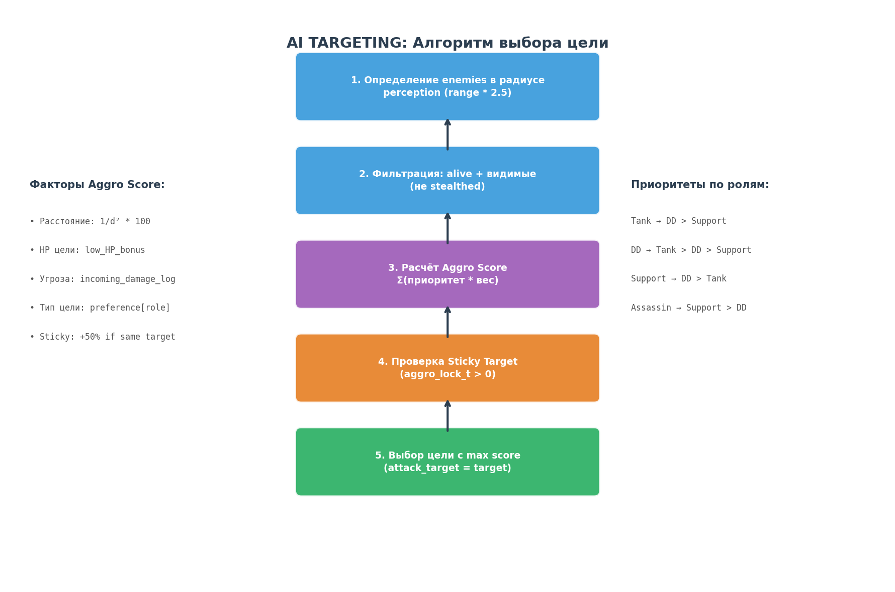
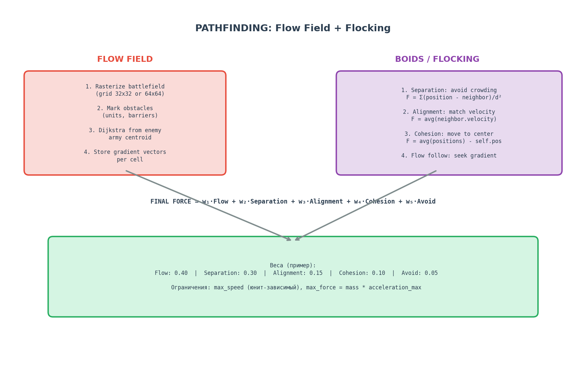

# BATTLE LEGION: Полная спецификация боевой системы
## Game Design Document (GDD) для разработки аналогичной игры

---

## TL;DR

Battle Legion — это мобильный **auto-battler** с массовыми боями **100×100** юнитов, где игрок проектирует армию (выбор юнитов + их позиционирование), а бой проходит полностью автоматически за **~20 секунд**. Боевая система строится на трёх китах: **Flow Field pathfinding** для навигации масс, **Boids flocking** для естественного движения групп, и **многофакторная Aggro-система** для выбора целей. Каждый юнит имеет чётко определённую роль (Tank/DD/Support/Assassin), фракционные синергии и слоты для Powerstones (модификаторов). Для реализации на **PixiJS** ключевые оптимизации — spatial hash для neighbor-lookup, object pooling для частиц и sprite-batching для отрисовки.

---

## 1. Общая архитектура боевой системы

### 1.1 Высокоуровневая структура

Боевая система Battle Legion представляет собой **автономный симулятор**, который получает на вход конфигурацию двух армий и через детерминированный расчёт (с возможным RNG для некоторых эффектов) выдаёт результат боя. Система спроектирована как **stateless computation** — результат боя зависит только от входных параметров, что позволяет легко реализовать серверную валидацию и replay-функциональность.



**Основные подсистемы** организованы в три слоя:

| Слой | Компоненты | Ответственность |
|------|-----------|----------------|
| **Input Layer** | Army Config, Unit Database, Powerstone Loadout | Валидация и подготовка входных данных |
| **Simulation Layer** | Combat Engine, Pathfinding, AI Targeting, Physics | Полный расчёт боя с фиксированным timestep |
| **Output Layer** | Battle Result, VFX Events, Camera Data | Формирование результата и визуальной последовательности |

Поток данных между слоями **строго однонаправленный**: Input → Simulation → Output. Это означает, что рендеринг и VFX никогда не влияют на исход боя — они лишь визуализируют уже рассчитанные события. Такой подход критически важен для **mobile-first** архитектуры, где рендеринг может происходить с переменным FPS, а симуляция должна оставаться детерминированной при фиксированном `dt = 1/60` секунды.

### 1.2 Жизненный цикл боя

Бой проходит через чётко определённые фазы, каждая из которых имеет фиксированную длительность или условие завершения:

| Фаза | Длительность | Описание |
|------|-------------|----------|
| **Setup** | 0.0s | Спавн юнитов по formation-конфигурации, инициализация state |
| **Approach** | 0.0–5.0s | Юниты движутся навстречу, ranged начинают атаковать на дистанции |
| **Engagement** | 5.0–15.0s | Основная фаза боя — массовое столкновение, AoE, способности |
| **Resolution** | 15.0–20.0s | Завершение — остатки армий добивают друг друга |
| **Cleanup** | +1.0s | Подсчёт результата, генерация VFX-событий для реплея |

Максимальная длительность боя — **20 секунд** реального времени. Если по истечении таймера обе стороны имеют живых юнитов, результатом является **Draw (ничья)**. Это фундаментальное ограничение, которое определяет баланс всех механик: юниты должны наносить достаточно урона, чтобы убить противника за отведённое время.

### 1.3 Детерминизм и RNG

Боевая система использует **контролируемый RNG**: генератор случайных чисел инициализируется seed, derived из конфигурации обеих армий. Это гарантирует, что одинаковые входные данные всегда производят одинаковый результат, что критично для:

- **Реплеев**: запись боя — это просто seed + конфигурация, replay пересчитывает бой на клиенте
- **Отката**: при отключении связи сервер может пересчитать бой и подтвердить результат
- **Тестирования**: фиксированные seed позволяют создавать регрессионные тесты

RNG применяется к следующим механикам: шанс крита, распределение AoE-урона по целям, вариации в AI-aggro (±10%), и визуальные эффекты (направление частиц).

---

## 2. Поле боя и позиционирование

### 2.1 Геометрия поля боя

Поле боя в Battle Legion — это **прямоугольная арена** с фиксированными размерами. Хотя точные размеры не раскрыты разработчиками, анализ геймплея и требования к позиционированию позволяют реконструировать следующие параметры:

| Параметр | Значение | Примечание |
|----------|----------|------------|
| Ширина поля | ~40–50 метров | Условных единиц |
| Высота поля | ~25–30 метров | Аспектное соотношение ~16:10 |
| Координатная система | float (x, y) | Непрерывная, не tile-based |
| Границы | Жёсткие стены | Юниты не могут выходить за пределы |
| Начальная позиция Player | y < 30% (нижняя часть) | ~5 метров от нижнего края |
| Начальная позиция Enemy | y > 70% (верхняя часть) | ~5 метров от верхнего края |

Поле боя **не содержит препятствий** — ни статичных объектов, ни динамических барьеров (кроме юнитов-стен типа Earthwardens). Это упрощает pathfinding до однородной навигации к противнику.

### 2.2 Система позиционирования (Formation Builder)

Игрок размещает юнитов в **formation editor** до начала боя. Каждый юнит-тип имеет **formation footprint** — занимаемую площадь, которая определяет минимальное расстояние между экземплярами одного типа. При размещении система обеспечивает:

- **Snap-to-grid** с шагом ~0.5 метра для удобного выравнивания
- **Collision detection** — невозможно разместить юнитов внутри footprint друг друга
- **Formation presets** — сохранённые шаблоны расстановки
- **Army Points limit** — максимальная "стоимость" армии

**Army Points** — фундаментальное ограничение армии:

| Ранг игрока | Макс. Army Points | Примечание |
|------------|-------------------|------------|
| Rank 0 (начало) | 6 | Доступны только Common юниты |
| Rank 3 | 11 | Открываются Rare юниты |
| Rank 5 | 13 | Первые Mythic юниты |
| Rank 16 (макс.) | 18 | Полный доступ ко всем юнитам |

Стоимость юнитов по редкости:

| Редкость | Стоимость в Army Points | Качество |
|----------|------------------------|----------|
| **Common** | 1 | Базовые юниты, простые механики |
| **Rare** | 2 | Продвинутые способности, синергии |
| **Mythic** | 3 | Уникальные механики, game-changers |

Такая система создаёт **интересный выбор** между количеством и качеством: армия из 6 Common юнитов против армии из 2 Rare + 2 Common имеет равную стоимость, но совершенно разную динамику.

### 2.3 Инициализация спавна

При старте боя юниты спавнятся согласно formation-конфигурации с небольшой **случайной вариацией** (±0.3 метра) для естественного вида. Каждый юнит инициализируется со следующим state:

```javascript
// Псевдокод инициализации юнита
class Unit {
  constructor(config) {
    // Позиция и движение
    this.position = config.position;        // Vector2
    this.velocity = { x: 0, y: 0 };         // Vector2
    this.heading = { x: 0, y: -1 };         // Направление (вверх = к врагу)
    
    // Базовые статы (зависят от unit_type и level)
    this.maxHP = calculateBaseHP(config.unitType, config.level);
    this.currentHP = this.maxHP;
    this.attackDamage = calculateBaseDamage(config.unitType, config.level);
    this.attackSpeed = config.unitType.baseAttackSpeed;
    this.movementSpeed = config.unitType.baseMovementSpeed;
    this.attackRange = config.unitType.baseAttackRange;
    
    // Боевая механика
    this.attackCooldown = 0;                // Текущий CD
    this.attackTarget = null;               // Текущая цель
    this.aggroLockTimer = 0;                // Таймер "липкости" цели
    this.isAlive = true;
    this.statusEffects = [];                // Активные эффекты
    
    // AI параметры
    this.perceptionRadius = this.attackRange * 2.5;
    this.targetPriority = config.unitType.aiProfile.targetWeights;
  }
}
```

---

## 3. Базовые параметры юнитов

### 3.1 Общая база юнитов

В игре **49 юнитов**, распределённых по 4 фракциям и 3 редкостям. Каждый юнит принадлежит к одной из **4 фракций**:

| Фракция | Архетип | Особенности | Примеры |
|---------|---------|-------------|---------|
| **Order** | Рыцари, рыцари-маги | Баланс между атакой и защитой, ауральные баффы | Shieldbearers, Paladin, Eternal Champions |
| **Nature** | Животные, друиды, духи | Регенерация, контроль поля, призыв | War Hounds, Dire Wolves, Phoenix |
| **Chaos** | Нежить, демоны, плевелы | Статус-эффекты, самоуничтожение, агрессия | Plaguebearers, Wraiths, Death Knight |
| **Construct** | Механизмы, големы, ловушки | Иммунитеты к статусам, статичность, AoE | Fortification, Catapult, Battle Wagon |

### 3.2 Полный список юнитов

| Ранг | Аббр. | Название | Редкость | Очки | Фракция | Иммунитеты |
|------|-------|----------|----------|------|---------|------------|
| 0 | SB | Shieldbearers | Common | 1 | Order | Stun |
| 0 | — | Archers | Common | 1 | Order | — |
| 1 | Wall | Fortification | Common | 1 | Construct | Burn, Plague, Freeze, Stun, Mind Control, Knockback |
| 1 | Dogs | War Hounds | Common | 1 | Nature | Freeze |
| 1 | — | Brute | Rare | 2 | Order | Freeze, Stun, Knockback |
| 2 | FT | Freezing Trap | Common | 1 | Construct | — |
| 2 | — | Assassins | Rare | 2 | Order | — |
| 2 | TG | Thornguards | Rare | 2 | Order | Stun, Knockback |
| 3 | BB | Bombot | Common | 1 | Construct | Plague |
| 3 | FW | Frost Wizard | Rare | 2 | Order | Freeze |
| 3 | Cata | Catapult | Mythic | 3 | Construct | Plague, Stun, Mind Control |
| 4 | HT | Hammer Throwers | Common | 1 | Order | Stun |
| 4 | PT | Plague Throwers | Rare | 2 | Order | Plague |
| 4 | BW | Battle Wagon | Mythic | 3 | Construct | Plague, Stun |
| 5 | MS | Mindshrooms | Common | 1 | Construct | — |
| 5 | BD | Battle Drummer | Rare | 2 | Order | Stun |
| 5 | Pala | Paladin | Mythic | 3 | Order | Plague |
| 6 | ER | Entangling Roots | Common | 1 | Nature | — |
| 6 | SN | Spider Nest | Rare | 2 | Construct | — |
| 6 | UB | Untamed Beast | Mythic | 3 | Nature | Mind Control, Stun, Knockback |
| 7 | CS | Crystal Spire | Common | 1 | Construct | Plague, Mind Control |
| 7 | EE | Earth Elemental | Rare | 2 | Nature | Burn, Stun, Plague |
| 7 | SC | Stormcaller | Mythic | 3 | Nature | — |
| 8 | AB | Arcane Blades | Common | 1 | Order | — |
| 8 | AA | Arcane Archer | Common | 1 | Order | — |
| 8 | BM | Barrier Monk | Rare | 2 | Order | — |
| 9 | PB | Plaguebearers | Common | 1 | Chaos | Plague, Mind Control |
| 9 | FaK | Faceless Knights | Rare | 2 | Chaos | Stun, Knockback |
| 9 | DK | Death Knight | Mythic | 3 | Chaos | — |
| 10 | — | Wraiths | Common | 1 | Chaos | Plague, Freeze, Stun, Knockback |
| 10 | EF | Emberfiend | Rare | 2 | Chaos | Burn, Freeze |
| 10 | MC | Mind Corruptor | Mythic | 3 | Chaos | Plague |
| 11 | BBB | Blessed Bombot | Common | 1 | Construct | Plague |
| 11 | RD | Righteous Defenders | Common | 1 | Order | — |
| 11 | Valk | Valkyrie | Rare | 2 | Order | — |
| 12 | DS | Draining Spirit | Common | 1 | Chaos | Burn, Plague, Freeze, Stun, Mind Control, Knockback |
| 12 | RW | Risen Warriors | Common | 1 | Chaos | Mind Control |
| 12 | SP | Soul Pylon | Rare | 2 | Construct | Plague, Mind Control |
| 13 | Crows | A Murder of Crows | Common | 1 | Nature | Mind Control, Plague |
| 13 | — | Druid | Common | 1 | Nature | — |
| 13 | AT | Ancient Tree | Mythic | 3 | Nature | Stun |
| 14 | DW | Dire Wolves | Common | 1 | Nature | Freeze, Stun |
| 14 | Toad | Giant Toad | Rare | 2 | Nature | Knockback, Stun |
| 14 | MH | Monster Hunter | Mythic | 3 | Order | — |
| 15 | FiK | Fire Knights | Common | 1 | Chaos | Burn, Freeze |
| 15 | MA | Molten Armor | Rare | 2 | Construct | Burn, Plague, Stun, Freeze, Knockback |
| 15 | — | Phoenix | Mythic | 3 | Nature | Burn, Freeze |
| 16 | CN | Cannoneer | Rare | 2 | Chaos | Physical Forces |
| 16 | EC | Eternal Champions | Mythic | 3 | Order | Burn, Freeze, Stun |

**Важное наблюдение**: Construct-юниты имеют наибольшее количество иммунитетов, что компенсирует их обычно статичную природу. Chaos-юниты часто имеют иммунитет к собственным статус-эффектам (Plaguebearers иммунны к Plague), что позволяет им безопасно использовать DoT-эффекты в ближнем бою.

### 3.3 Шкала прогрессии и базовые статы

Каждый юнит прокачивается с **уровня 1 до 16**. При повышении уровня увеличиваются **HP и урон**, а также численность отряда:

| Уровень | Численность Common | Численность Rare | Численность Mythic | Слоты Powerstone |
|---------|-------------------|------------------|--------------------|-----------------|
| 1 | 3 юнита | 2 юнита | 1 юнит | 0 |
| 4 | 4 юнита | 2 юнита | 1 юнит | 1 (открывается) |
| 7 | 5 юнитов | 3 юнита | 2 юнита | 1 |
| 8 | 5 юнитов | 3 юнита | 2 юнита | 2 (открывается) |
| 10 | 6 юнитов | 4 юнита | 2 юнита | 2 |
| 12 | 6 юнитов | 4 юнита | 3 юнита | 3 (открывается) |
| 16 | 7 юнитов | 5 юнитов | 3 юнита | 3 |

**Формула масштабирования статов** по уровню:

```
HP(level) = HP_base × (1 + 0.08 × (level - 1))
Damage(level) = Damage_base × (1 + 0.06 × (level - 1))
```

Коэффициент **8% для HP** и **6% для урона** обеспечивают ощутимый, но не катастрофический рост силы. Разница между уровнем 1 и 16 составляет **~3.2× HP** и **~2.9× урона**, что создаёт значимый стимул к прокачке, но не делает низкоуровневые юниты полностью бесполезными.

### 3.4 Классификация по боевым ролям

Каждый юнит относится к одной из **4 боевых ролей**, которые определяют его AI-поведение и приоритеты в бою:

| Роль | Приоритет целей | Основная задача | Примеры |
|------|----------------|-----------------|---------|
| **Tank** | DD → Support | Поглощать урон, создавать frontline | Shieldbearers, Earth Elemental, Molten Armor |
| **Damage Dealer (DD)** | Tank → DD → Support | Наносить урон | Archers, Hammer Throwers, Stormcaller |
| **Support** | DD → Tank | Баффы, хил, контроль | Barrier Monk, Druid, Battle Drummer |
| **Assassin** | Support → DD | Пробивать к backline | Assassins, Wraiths, Arcane Blades |

Эта классификация влияет на **target selection AI** (см. раздел 5) и формирует "камень-ножницы-бумагу" тактического слоя: Assassin-команда побеждает Support-зависимые армии, Tank- army сдерживает Assassins, а DD-focused армия пробивает Tank-wall.

---

## 4. Система урона и защиты

### 4.1 Базовая формула урона

Battle Legion использует **упрощённую модель урона** без сложных промежуточных вычислений. Основная формула:

```
Final Damage = Base Damage × Damage Multiplier × Crit Multiplier × (1 - Damage Reduction)
```

Где:

| Компонент | Формула / Диапазон | Примечание |
|-----------|-------------------|------------|
| **Base Damage** | unit.attackDamage | Скалируется с уровнем |
| **Damage Multiplier** | 1.0 + Σ(buffs) - Σ(debuffs) | Обычно 0.5–2.0 |
| **Crit Multiplier** | 1.0 (обычно) или 2.0 (крит) | Базовый шанс крита ~5% |
| **Damage Reduction** | 0.0–0.95 | Максимум 95% (минимум 5% урона) |

Критическая механика: базовый шанс критического удара у всех юнитов **5%**. Некоторые Powerstones и способности могут увеличивать этот шанс. Крит наносит **2× урона** и визуально отображается увеличенными цифрами.

### 4.2 Система Damage Reduction

Damage Reduction в Battle Legion работает как **множитель**, а не как броня в традиционном понимании. Каждый юнит имеет базовый DR от своей роли:

| Роль | Базовый DR | Примечание |
|------|-----------|------------|
| Tank | 30–50% | Зависит от конкретного юнита |
| DD ( melee) | 10–20% | |
| DD (ranged) | 0–10% | Минимальная защита |
| Support | 5–15% | |
| Assassin | 0–10% | |

Формула применения DR:

```javascript
function calculateDamageReduction(unit, attacker) {
  let dr = unit.baseDamageReduction;
  
  // Powerstone: Defensive — уменьшает весь входящий урон
  if (unit.hasPowerstone('defensive_reduce')) {
    dr += unit.powerstoneValue('defensive_reduce'); // обычно +15-25%
  }
  
  // Powerstone: Defensive — игнорирование 1 атаки каждые X сек
  if (unit.hasPowerstone('defensive_dodge_periodic')) {
    if (unit.timeSinceLastDodge > unit.dodgeInterval) {
      return 1.0; // 100% DR — атака полностью блокирована
    }
  }
  
  // Статус-эффект: заморозка увеличивает получаемый урон
  if (unit.hasStatusEffect('frozen')) {
    dr = Math.max(0, dr - 0.25); // −25% DR при заморозке
  }
  
  // Кап: максимум 95% reduction
  return Math.min(0.95, Math.max(0, dr));
}
```

### 4.3 Статус-эффекты и DoT

Battle Legion использует **6 основных статус-эффектов**, каждый с уникальной механикой:

| Эффект | Действие | Длительность | Способ применения | Иммунитет |
|--------|----------|--------------|-------------------|-----------|
| **Burn** | DoT: 3% maxHP/sec | 5 сек | Контакт, AoE, ranged | Burn immune |
| **Freeze** | Остановка движения и атаки | 2–4 сек | Контакт, ranged, AoE | Freeze immune |
| **Plague** | DoT: 2% maxHP/sec, −20% damage | 6 сек | Контакт, AoE, projectile | Plague immune |
| **Stun** | Полная остановка | 1.5–3 сек | Контакт, ranged | Stun immune |
| **Mind Control** | Переключение на сторону врага | 4–8 сек | Способность | Mind Control immune |
| **Knockback** | Отбрасывание на 3–5 метров | Мгновенно | Контакт, AoE | Knockback immune |

**Механика DoT-эффектов** (Burn, Plague):

```javascript
// DoT наносит урон каждые 0.5 секунд
// Формула: dotDamage = maxHP * percentPerSecond * 0.5
// DoT не учитывает DR цели — чистый процентный урон
// Несколько DoT одного типа не стакаются — обновляют длительность
// Разные типы DoT стакаются: Burn + Plague = 5% maxHP/sec суммарно
```

**Механика Freeze** — особенно важная для баланса:

- Замороженный юнит не может двигаться, атаковать или использовать способности
- Замороженный юнит получает **+25% урона** (DR reduced)
- Некоторые юниты (Icebreaker) мгновенно убивают замороженных
- Freeze immune юниты полностью игнорируют этот эффект

### 4.4 Иммунитеты

Каждый юнит имеет список **иммунитетов к статус-эффектам**. Иммунитет — это абсолютная защита: эффект просто не применяется. Система иммунитетов создаёт слой контр-игры:

```javascript
function applyStatusEffect(unit, effect) {
  if (unit.immunities.includes(effect.type)) {
    // Эффект полностью блокирован
    // Визуальный feedback: белый щиток над юнитом
    return false;
  }
  
  if (unit.hasPowerstone('defensive_status_nullify')) {
    // Эффект блокирован Powerstone
    // Возможно: обратный бафф (например, +скорость при попытке заморозки)
    unit.addBuff(effect.reverseBuff);
    return false;
  }
  
  // Применяем эффект
  unit.statusEffects.push(effect);
  return true;
}
```

---

## 5. AI Targeting и Aggro-система

### 5.1 Общий принцип

Каждый юнит в Battle Legion имеет **автономный AI**, который принимает решения на основе локальной информации. AI оперирует тремя основными задачами:

1. **Target Selection** — выбор цели для атаки
2. **Movement Decision** — решение о движении (вперёд/стоять/назад)
3. **Ability Usage** — использование специальных способностей

Все решения принимаются каждый кадр симуляции (60 раз в секунду) на основе текущего state юнита и его окружения.

### 5.2 Алгоритм выбора цели



Процесс выбора цели проходит через **5 стадий**:

**Стадия 1: Определение потенциальных целей**

```javascript
function getPotentialTargets(unit, allEnemies) {
  const perceptionRadius = unit.attackRange * 2.5;
  
  return allEnemies.filter(enemy => {
    if (!enemy.isAlive) return false;
    if (enemy.isStealthed && !unit.hasTrueSight) return false;
    
    const distance = vec2Distance(unit.position, enemy.position);
    return distance <= perceptionRadius;
  });
}
```

**Стадия 2: Расчёт Aggro Score**

```javascript
function calculateAggroScore(unit, target, gameState) {
  let score = 0;
  const distance = vec2Distance(unit.position, target.position);
  
  // Фактор 1: Расстояние (ближе = выше приоритет)
  const distanceScore = (1.0 / (distance * distance + 1)) * 100;
  score += distanceScore;
  
  // Фактор 2: HP цели (низкий HP = бонус к приоритету)
  const hpRatio = target.currentHP / target.maxHP;
  const lowHPBonus = hpRatio < 0.3 ? 30 : 0;
  score += lowHPBonus;
  
  // Фактор 3: Ролевой приоритет (зависит от роли атакующего)
  const rolePriority = getRolePriority(unit.role, target.role);
  score += rolePriority * 20;
  
  // Фактор 4: Угроза (кто нанёс мне больше всего урона)
  const damageFromTarget = unit.damageLog.get(target.id, 0);
  const threatScore = Math.min(damageFromTarget / unit.maxHP * 50, 25);
  score += threatScore;
  
  // Фактор 5: Sticky target (предпочтение текущей цели)
  if (unit.attackTarget === target) {
    score *= 1.5; // +50% к score текущей цели
  }
  
  // Фактор 6: Фракционный бонус (некоторые юниты ненавидят конкретные фракции)
  if (unit.factionHate && unit.factionHate === target.faction) {
    score += 15;
  }
  
  // Случайная вариация (±10% для непредсказуемости)
  const randomFactor = 0.9 + Math.random() * 0.2;
  score *= randomFactor;
  
  return score;
}
```

**Ролевые приоритеты** (значения rolePriority):

| Атакующий \ Цель | Tank | DD | Support | Assassin |
|-----------------|------|-----|---------|----------|
| **Tank** | 2 | 5 | 3 | 4 |
| **DD** | 4 | 3 | 2 | 3 |
| **Support** | 2 | 4 | 1 | 3 |
| **Assassin** | 1 | 3 | 5 | 2 |

**Стадия 3: Финальный выбор**

```javascript
function selectTarget(unit, potentialTargets) {
  if (potentialTargets.length === 0) return null;
  
  // Проверяем sticky target
  if (unit.attackTarget && unit.attackTarget.isAlive) {
    const stickyDistance = vec2Distance(unit.position, unit.attackTarget.position);
    if (stickyDistance <= unit.attackRange * 3 && unit.aggroLockTimer > 0) {
      return unit.attackTarget;
    }
  }
  
  // Выбираем цель с максимальным score
  let bestTarget = potentialTargets[0];
  let bestScore = -Infinity;
  
  for (const target of potentialTargets) {
    const score = calculateAggroScore(unit, target);
    if (score > bestScore) {
      bestScore = score;
      bestTarget = target;
    }
  }
  
  // Устанавливаем sticky lock
  if (bestTarget !== unit.attackTarget) {
    unit.attackTarget = bestTarget;
    unit.aggroLockTimer = 1.5; // 1.5 секунды "липкости"
  }
  
  return bestTarget;
}
```

### 5.3 Aggro Lock и Sticky Target

**Aggro Lock** — механика, которая предотвращает слишком частое переключение целей. Когда юнит выбирает новую цель, устанавливается таймер **1.5 секунды**, в течение которого цель не будет меняться (если не выйдет за пределы perception radius × 1.2).

Это создаёт **реалистичное ощущение боя**: юниты не "прыгают" между целями каждый кадр, а фокусируются на одном противнике. Однако если более привлекательная цель появляется рядом (score в 2+ раза выше текущей), sticky target может быть перезаписан.

### 5.4 AI-роли и специфическое поведение

Некоторые юниты имеют **уникальное AI-поведение**, переопределяющее стандартный алгоритм:

| Юнит | Специфическое поведение AI |
|------|---------------------------|
| **Assassins** | Игнорируют frontline, ищут путь к backline через gaps |
| **Wraiths** | Фазирут через юнитов, игнорируют collision |
| **Arcane Blades** | Телепортируются за линию врага, затем атакуют сзади |
| **Barrier Monk** | Не атакуют, позиционируются между ranged юнитами и врагом |
| **Crystal Spire** | Полностью статичны, атакуют ближайшего врага в range |
| **Catapult** | Атакуют случайную цель, +200% урона статичным юнитам |
| **Risen Warriors** | Спавнятся за линией врага, атакуют support/ranged |
| **Valkyrie** | Прикрепляются к одному союзнику, следуют за ним |
| **Revenant** | Наводятся на врага с максимальным HP |

---

## 6. Pathfinding и навигация

### 6.1 Гибридный подход: Flow Field + Boids

Battle Legion использует **гибридную систему навигации**, которая сочетает глобальное планирование маршрута с локальным избеганием столкновений. Этот подход критически важен для массовых боёв: чистый A* был бы неприменим из-за O(n²) сложности, а чистый Boids давал бы хаотичное движение без целенаправленности.



### 6.2 Flow Field — глобальная навигация

Flow Field (поле потока) — это предвычисленное поле векторов, указывающих направление к цели из любой точки поля боя. В Battle Legion Flow Field пересчитывается каждые **0.5 секунды**:

```javascript
class FlowField {
  constructor(gridWidth, gridHeight, cellSize) {
    this.gridW = Math.ceil(gridWidth / cellSize);
    this.gridH = Math.ceil(gridHeight / cellSize);
    this.cellSize = cellSize;
    this.field = new Array(this.gridW * this.gridH); // Vector2 per cell
  }
  
  // Пересчёт поля к целевой точке
  recalculate(targetPosition, obstacles) {
    const targetCell = this.worldToCell(targetPosition);
    
    // Dijkstra / Eikonal equation для расчёта расстояний
    const distances = this.solveEikonal(targetCell, obstacles);
    
    // Вычисление градиентов (направлений) из расстояний
    for (let y = 0; y < this.gridH; y++) {
      for (let x = 0; x < this.gridW; x++) {
        const idx = y * this.gridW + x;
        this.field[idx] = this.computeGradient(distances, x, y);
      }
    }
  }
  
  // Получение направления в точке мира
  getDirection(worldPos) {
    const cell = this.worldToCell(worldPos);
    const idx = cell.y * this.gridW + cell.x;
    return this.field[idx] || { x: 0, y: -1 }; // default: вперёд
  }
}
```

**Оптимизация**: Flow Field пересчитывается не отдельно для каждого юнита, а **от центроида вражеской армии**. Это значит, что все юниты одной стороны используют одно и то же поле направлений — огромная экономия вычислений.

### 6.3 Boids Flocking — локальное поведение

Для реалистичного движения групп юнитов Battle Legion применяет **модифицированный алгоритм Boids** (Reynolds, 1987) с тремя основными силами:

```javascript
class BoidsSystem {
  // 1. Separation — избегание столкновений
  computeSeparationForce(unit, neighbors) {
    let force = { x: 0, y: 0 };
    let count = 0;
    
    for (const neighbor of neighbors) {
      const diff = vec2Subtract(unit.position, neighbor.position);
      const dist = vec2Length(diff);
      
      if (dist > 0 && dist < unit.separationRadius) {
        // Чем ближе, тем сильнее отталкивание
        const strength = 1.0 / (dist * dist);
        force.x += (diff.x / dist) * strength;
        force.y += (diff.y / dist) * strength;
        count++;
      }
    }
    
    if (count > 0) {
      force.x /= count;
      force.y /= count;
      vec2Normalize(force);
      force.x *= unit.maxForce * 1.5; // Separation имеет высокий приоритет
      force.y *= unit.maxForce * 1.5;
    }
    
    return force;
  }
  
  // 2. Alignment — выравнивание скорости с соседями
  computeAlignmentForce(unit, neighbors) {
    let avgVelocity = { x: 0, y: 0 };
    let count = 0;
    
    for (const neighbor of neighbors) {
      if (neighbor.isAlive && neighbor.faction === unit.faction) {
        avgVelocity.x += neighbor.velocity.x;
        avgVelocity.y += neighbor.velocity.y;
        count++;
      }
    }
    
    if (count > 0) {
      avgVelocity.x /= count;
      avgVelocity.y /= count;
      vec2Normalize(avgVelocity);
      avgVelocity.x *= unit.maxSpeed;
      avgVelocity.y *= unit.maxSpeed;
      
      // Steering = desired - current
      return vec2Scale(vec2Subtract(avgVelocity, unit.velocity), 0.5);
    }
    
    return { x: 0, y: 0 };
  }
  
  // 3. Cohesion — движение к центру группы
  computeCohesionForce(unit, neighbors) {
    let center = { x: 0, y: 0 };
    let count = 0;
    
    for (const neighbor of neighbors) {
      if (neighbor.isAlive && neighbor.faction === unit.faction) {
        center.x += neighbor.position.x;
        center.y += neighbor.position.y;
        count++;
      }
    }
    
    if (count > 0) {
      center.x /= count;
      center.y /= count;
      
      // Seek steering towards center
      const desired = vec2Subtract(center, unit.position);
      vec2Normalize(desired);
      desired.x *= unit.maxSpeed;
      desired.y *= unit.maxSpeed;
      
      return vec2Scale(vec2Subtract(desired, unit.velocity), 0.3);
    }
    
    return { x: 0, y: 0 };
  }
}
```

### 6.4 Комбинирование сил и применение

Итоговая сила движения — это **взвешенная сумма** всех компонентов:

```javascript
function computeFinalForce(unit, flowField, boids, enemies) {
  // Flow Field — следование глобальному маршруту
  const flowDir = flowField.getDirection(unit.position);
  const flowForce = {
    x: flowDir.x * unit.maxForce * 0.40,
    y: flowDir.y * unit.maxForce * 0.40
  };
  
  // Boids forces
  const neighbors = spatialHash.query(unit.position, unit.perceptionRadius);
  const separation = boids.computeSeparationForce(unit, neighbors);
  const alignment = boids.computeAlignmentForce(unit, neighbors);
  const cohesion = boids.computeCohesionForce(unit, neighbors);
  
  // Avoidance — избегание врагов в ближнем бою
  const avoidance = computeAvoidanceForce(unit, enemies);
  
  // Суммирование
  let finalForce = { x: 0, y: 0 };
  finalForce.x = flowForce.x + separation.x * 0.30 + alignment.x * 0.15 + cohesion.x * 0.10 + avoidance.x * 0.05;
  finalForce.y = flowForce.y + separation.y * 0.30 + alignment.y * 0.15 + cohesion.y * 0.10 + avoidance.y * 0.05;
  
  // Ограничение максимальной силы
  const forceMag = vec2Length(finalForce);
  if (forceMag > unit.maxForce) {
    vec2Scale(finalForce, unit.maxForce / forceMag);
  }
  
  return finalForce;
}

// Физическое обновление
function updateUnitPhysics(unit, dt) {
  // F = ma  =>  a = F/m
  const acceleration = {
    x: unit.steeringForce.x / unit.mass,
    y: unit.steeringForce.y / unit.mass
  };
  
  // Обновление скорости
  unit.velocity.x += acceleration.x * dt;
  unit.velocity.y += acceleration.y * dt;
  
  // Ограничение максимальной скорости
  const speed = vec2Length(unit.velocity);
  if (speed > unit.movementSpeed) {
    unit.velocity.x = (unit.velocity.x / speed) * unit.movementSpeed;
    unit.velocity.y = (unit.velocity.y / speed) * unit.movementSpeed;
  }
  
  // Обновление позиции
  unit.position.x += unit.velocity.x * dt;
  unit.position.y += unit.velocity.y * dt;
}
```

### 6.5 Оптимизация: Spatial Hash

Для 100+ юнитов квадратичный поиск соседей (O(n²)) неприменим. Battle Legion использует **Uniform Spatial Hash**:

```javascript
class SpatialHash {
  constructor(cellSize) {
    this.cellSize = cellSize;
    this.cells = new Map(); // key: "x,y" → Set of units
  }
  
  insert(unit) {
    const cellX = Math.floor(unit.position.x / this.cellSize);
    const cellY = Math.floor(unit.position.y / this.cellSize);
    const key = `${cellX},${cellY}`;
    
    if (!this.cells.has(key)) this.cells.set(key, new Set());
    this.cells.get(key).add(unit);
    unit._spatialKey = key;
  }
  
  query(position, radius) {
    const results = [];
    const cellRadius = Math.ceil(radius / this.cellSize);
    const centerX = Math.floor(position.x / this.cellSize);
    const centerY = Math.floor(position.y / this.cellSize);
    
    for (let dx = -cellRadius; dx <= cellRadius; dx++) {
      for (let dy = -cellRadius; dy <= cellRadius; dy++) {
        const key = `${centerX + dx},${centerY + dy}`;
        const cell = this.cells.get(key);
        if (cell) {
          for (const unit of cell) {
            if (vec2Distance(position, unit.position) <= radius) {
              results.push(unit);
            }
          }
        }
      }
    }
    
    return results;
  }
  
  clear() {
    this.cells.clear();
  }
}
```

С размером ячейки **2.0 метра** и perception radius ~5–10 метров, каждый запрос проверяет **9–25 ячеек**, что снижает сложность с O(n²) до **O(1)** для практических целей (амортизированно).

### 6.6 Скорости движения юнитов

| Категория | Базовая скорость | Примеры |
|-----------|-----------------|---------|
| **Медленные (Tank)** | 1.5–2.0 м/с | Shieldbearers, Earth Elemental, Thornguards |
| **Средние (Melee DD)** | 2.5–3.0 м/с | War Hounds, Hammer Throwers, Plaguebearers |
| **Быстрые (Assassin)** | 3.5–4.5 м/с | Assassins, Wraiths, Arcane Blades |
| **Статичные** | 0 м/с | Crystal Spire, Fortification, Spider Nest |
| **Ranged (при отступлении)** | 1.0–1.5 м/с | Archers, Frost Wizard (движутся назад если враг близко) |

---

## 7. Атака и боевые циклы

### 7.1 Базовый цикл атаки

Каждый юнит проходит через цикл **Move → Target → Attack → Cooldown**:

```javascript
function updateUnitCombat(unit, dt, gameState) {
  // 1. Обновление кулдаунов
  if (unit.attackCooldown > 0) {
    unit.attackCooldown -= dt;
  }
  if (unit.aggroLockTimer > 0) {
    unit.aggroLockTimer -= dt;
  }
  
  // 2. Выбор цели
  const enemies = gameState.getEnemyUnits(unit.faction);
  const potentialTargets = getPotentialTargets(unit, enemies);
  
  if (potentialTargets.length === 0) {
    // Нет целей в зоне — двигаемся к врагу
    unit.state = 'MOVING';
    return;
  }
  
  unit.attackTarget = selectTarget(unit, potentialTargets);
  
  // 3. Проверка дистанции
  const distanceToTarget = vec2Distance(unit.position, unit.attackTarget.position);
  
  if (distanceToTarget > unit.attackRange) {
    // Слишком далеко — двигаемся к цели
    unit.state = 'MOVING';
    unit.movementTarget = unit.attackTarget.position;
  } else {
    // В зоне атаки
    if (unit.attackCooldown <= 0) {
      // Атакуем!
      performAttack(unit, unit.attackTarget, gameState);
      unit.attackCooldown = 1.0 / unit.attackSpeed;
      unit.state = 'ATTACKING';
    } else {
      // Ждём кулдаун — стоим на месте
      unit.state = 'IDLE';
    }
  }
}
```

### 7.2 Типы атак

| Тип атаки | Механика | Примеры юнитов |
|-----------|----------|----------------|
| **Melee** | Урон одной цели в radius 0.5м | Shieldbearers, War Hounds, Brute |
| **Ranged Projectile** | Снаряд летит к цели, может промахнуться | Archers, Arcane Archer, Plague Throwers |
| **Ranged Instant** | Урон мгновенно по цели | Frost Wizard, Stormcaller |
| **AoE (Area)** | Урон по всем в radius | Hammer Throwers, Catapult |
| **Chain** | Перескакивает между целями | Stormcaller (chain lightning) |
| **Piercing** | Проходит сквозь цели | Arcane Archer |
| **Delayed Spawn** | Юниты появляются позже | Risen Warriors, Risen Archers |
| **Aura/Passive** | Постоянный эффект в радиусе | Paladin (heal aura), Death Knight (anti-heal) |

### 7.3 Проектайлы и их физика

```javascript
class Projectile {
  constructor(config) {
    this.position = config.startPosition;
    this.velocity = vec2Scale(
      vec2Normalize(vec2Subtract(config.targetPosition, config.startPosition)),
      config.speed
    );
    this.target = config.target;
    this.damage = config.damage;
    this.isPiercing = config.isPiercing || false;
    this.piercedTargets = new Set();
  }
  
  update(dt, gameState) {
    // Движение
    this.position.x += this.velocity.x * dt;
    this.position.y += this.velocity.y * dt;
    
    // Проверка столкновений
    const enemies = gameState.getEnemyUnits(this.sourceFaction);
    for (const enemy of enemies) {
      if (this.piercedTargets.has(enemy.id)) continue;
      
      const dist = vec2Distance(this.position, enemy.position);
      if (dist < enemy.hitboxRadius + this.hitboxRadius) {
        // Попадание!
        dealDamage(this.source, enemy, this.damage);
        
        if (!this.isPiercing) {
          return 'DESTROYED'; // Снаряд уничтожен
        } else {
          this.piercedTargets.add(enemy.id);
          this.damage *= 0.8; // −20% урона после каждого пробития
        }
      }
    }
    
    // Проверка выхода за границы
    if (isOutOfBounds(this.position)) return 'DESTROYED';
    
    return 'ACTIVE';
  }
}
```

### 7.4 Скорости атаки (Attack Speed)

| Категория | Атак в секунду | Примеры |
|-----------|---------------|---------|
| **Очень медленная** | 0.3–0.5 | Catapult, Hammer Throwers |
| **Медленная** | 0.5–0.8 | Crystal Spire, Earth Elemental |
| **Средняя** | 1.0–1.5 | Shieldbearers, Archers, War Hounds |
| **Быстрая** | 2.0–3.0 | Assassins, Arcane Blades |
| **Очень быстрая** | 4.0+ | Spider Nest (спавн пауков), A Murder of Crows |

**Важно**: быстрые атаки с низким уроном эффективны против "dodge every X seconds" Powerstone (триггерят его на слабые атаки), но слабы против "reduce 1 attack every X seconds". Медленные мощные атаки — наоборот.

---

## 8. Powerstones — система модификаторов

### 8.1 Общая концепция

Powerstones — это **модификаторы**, которые игрок экипирует на юнитов для кастомизации их поведения. Каждый юнит получает слоты на уровнях **4, 8 и 12** (итого 3 слота). Powerstones привязаны к **сезонам** — каждый новый Era сбрасывает инвентарь и вводит новый набор.

### 8.2 Категории Powerstones

| Категория | Эффект | Подтипы | Лучшие для |
|-----------|--------|---------|-----------|
| **Offensive** | Увеличение урона | +X% к урону; Первая атака +100%; Instakill < X% HP; Berserk (ниже HP = выше урон) | DD, быстрые юниты |
| **Defensive** | Снижение получаемого урона | −X% всего урона; Блок 1 атаки каждые X сек; Status nullify → buff; +HP | Tank, Support |
| **Ability** | Усиление способностей | +X% potency хила/урона способности; −CD; +Radius | Support, Healer |
| **Movement** | Скорость движения | +X% speed; Heal while moving; −X% speed (для задержки) | Melee, mobile units |
| **Range** | Дальность и атака | +X% range; X% шанс double damage; Instant CD attack | Ranged, slow attackers |

### 8.3 Примеры конкретных Powerstones

| Powerstone | Тип | Эффект | Лучшие юниты |
|------------|-----|--------|-------------|
| **Potency+** | Offensive | Увеличивает весь урон на 15–25% | Любые DD |
| **First Strike** | Offensive | Первая атака наносит +100% урона | Медленные DD с высоким базовым уроном |
| **Executioner** | Offensive | Мгновенное убийство если HP < 8–15% | Быстрые юниты (Assassins) |
| **Berserk** | Offensive | Урон +30–50% когда HP < 30% | Tank с высоким HP |
| **Damage Reduction** | Defensive | Весь входящий урон −15–25% | Любые frontline юниты |
| **Periodic Dodge** | Defensive | Игнорирование 1 атаки каждые 4–6 сек | Ranged (редко получают урон) |
| **Status Reverse** | Defensive | Блокировка дебаффа + обратный бафф | Юниты без нативных иммунитетов |
| **Ability Boost** | Ability | +20–35% potency способностей | Barrier Monk, Druid |
| **Speed Boost** | Movement | +15–25% скорости движения | Медленные Tank |
| **Heal on Move** | Movement | Восстановление 1–2% HP/sec при движении | Melee юниты |
| **Range+** | Range | +15–25% к дальности атаки | Ranged с коротким range |
| **Double Strike** | Range | 10–15% шанс удвоить урон атаки | Быстрые юниты, Healer |

---

## 9. Камера и визуальная система

### 9.1 Камера во время боя

Камера в Battle Legion **полностью автоматическая** — игрок не управляет ею во время боя. Система камеры использует **смарт-фоллоу** с несколькими режимами:

| Режим камеры | Триггер | Поведение |
|-------------|---------|-----------|
| **Overview** | 0–3 сек (начало) | Высокий угол, показывает обе армии целиком |
| **Engagement** | 3–15 сек (основной бой) | Следует за центром масс активных юнитов |
| **Drama** | Критическое событие | Приближение к Mythic юниту или массовому AoE |
| **Finish** | < 5 юнитов осталось | Zoom на финальную дуэль |

**Параметры камеры**:

```javascript
const CAMERA_CONFIG = {
  // Обзорный режим
  overviewHeight: 35,      // метров (видит всё поле)
  overviewAngle: 55,       // градусов от горизонта
  
  // Боевой режим
  combatHeight: 15,        // метров
  combatAngle: 45,
  
  // Smoothing
  positionLerp: 0.05,      // 5% за кадр
  zoomLerp: 0.03,          // 3% за кадр
  
  // Shake при мощных ударах
  shakeIntensity: 0.3,     // метров
  shakeDecay: 0.9,         // за кадр
};
```

### 9.2 Визуальная иерархия

Battle Legion использует **многоуровневую систему отображения** для читаемости массовых боёв:

| Уровень | Элемент | Приоритет отрисовки |
|---------|---------|-------------------|
| **Фон** | Поле боя, декорации | Самый низкий |
| **Ground effects** | AoE зоны, ловушки | Низкий |
| **Юниты** | Спрайты юнитов | Средний (sort by Y) |
| **VFX** | Частицы, вспышки | Высокий |
| **UI Overlay** | HP bars, damage numbers | Самый высокий |

**Отрисовка юнитов**: юниты сортируются по **Y-координате** (далёкие от камеры рисуются первыми — painter's algorithm). Это создаёт правильное перекрытие для top-down вида.

### 9.3 Damage Numbers и UI Feedback

```javascript
// Система floating damage numbers
class DamageNumber {
  constructor(position, damage, isCrit, damageType) {
    this.position = { ...position };
    this.velocity = { x: (Math.random() - 0.5) * 1, y: -2 }; // Всплывает вверх
    this.damage = Math.round(damage);
    this.isCrit = isCrit;
    this.lifetime = 1.0; // секунда
    
    // Цвет в зависимости от типа
    this.color = isCrit ? '#FF4400' : '#FFFFFF';
    this.fontSize = isCrit ? 18 : 14;
  }
  
  update(dt) {
    this.position.x += this.velocity.x * dt;
    this.position.y += this.velocity.y * dt;
    this.velocity.y += 3 * dt; // Гравитация
    this.lifetime -= dt;
    
    // Fade out
    this.alpha = Math.max(0, this.lifetime);
  }
}
```

### 9.4 HP Bars

Каждый юнит-отряд (squad) отображает **один HP bar** над группой, представляющий суммарное HP всех юнитов в отряде:

```javascript
// HP bar = суммарное HP всех юнитов в отряде
squad.totalHP = squad.members.reduce((sum, u) => sum + u.currentHP, 0);
squad.maxTotalHP = squad.members.reduce((sum, u) => sum + u.maxHP, 0);
squad.hpRatio = squad.totalHP / squad.maxTotalHP;

// Отображается только если HP < 100% или при получении урона
// Hide delay: 2 секунды после последнего урона
```

---

## 10. PixiJS-специфика: рекомендации по реализации

### 10.1 Архитектура рендеринга

Учитывая, что вы используете **PixiJS** и самописный движок, вот рекомендуемая архитектура:

```javascript
// Основные слои PixiJS Container
class BattleRenderer {
  constructor(app) {
    this.app = app;
    
    // Слои (в порядке отрисовки)
    this.layers = {
      background: new PIXI.Container(),
      groundEffects: new PIXI.Container(),
      units: new PIXI.Container(),  // Юниты сортируются по Y
      projectiles: new PIXI.Container(),
      vfx: new PIXI.Container(),
      ui: new PIXI.Container(),      // HP bars, damage numbers
    };
    
    // Добавляем слои на stage
    Object.values(this.layers).forEach(layer => {
      app.stage.addChild(layer);
    });
    
    // Object pools для производительности
    this.pools = {
      damageNumbers: new ObjectPool(() => new DamageNumberSprite(), 100),
      projectiles: new ObjectPool(() => new ProjectileSprite(), 50),
      particles: new ParticlePool(500),
    };
  }
  
  // Сортировка юнитов по Y каждый кадр
  updateUnitDepth() {
    this.layers.units.children.sort((a, b) => a.y - b.y);
  }
}
```

### 10.2 Object Pooling — критически важно

Для 100+ юнитов и сотен частиц **Object Pooling** обязателен:

```javascript
class ObjectPool {
  constructor(factory, initialSize) {
    this.factory = factory;
    this.available = [];
    this.inUse = new Set();
    
    // Предзаполняем пул
    for (let i = 0; i < initialSize; i++) {
      this.available.push(this.factory());
    }
  }
  
  acquire() {
    let obj = this.available.pop();
    if (!obj) {
      obj = this.factory(); // Расширяем при необходимости
    }
    this.inUse.add(obj);
    obj.visible = true;
    return obj;
  }
  
  release(obj) {
    if (this.inUse.has(obj)) {
      this.inUse.delete(obj);
      obj.visible = false;
      this.available.push(obj);
    }
  }
}
```

### 10.3 Sprite Batching

PixiJS автоматически батчит спрайты с одинаковой текстурой. Для максимальной производительности:

```javascript
// Используйте SpriteSheet с ALL юнитами
const spriteSheet = PIXI.BaseTexture.from('units_spritesheet.png');

// Создавайте спрайты из одной BaseTexture
// PixiJS автоматически batch-ит их в один draw call
const unitTextures = {
  shieldbearer: new PIXI.Texture(spriteSheet, frame1),
  archer: new PIXI.Texture(spriteSheet, frame2),
  // ...
};

// Для анимации — используйте AnimatedSprite
// Или ручное переключение texture для простых случаев
```

### 10.4 Spatial Hash в симуляции

```javascript
// Интеграция spatial hash в игровой цикл
class BattleSimulation {
  update(dt) {
    // 1. Перестроить spatial hash
    this.spatialHash.clear();
    for (const unit of this.allUnits) {
      if (unit.isAlive) {
        this.spatialHash.insert(unit);
      }
    }
    
    // 2. Обновить AI (используя spatial hash для neighbor queries)
    for (const unit of this.allUnits) {
      if (unit.isAlive) {
        this.updateUnitAI(unit, dt);
      }
    }
    
    // 3. Обновить физику
    for (const unit of this.allUnits) {
      if (unit.isAlive) {
        this.updateUnitPhysics(unit, dt);
      }
    }
    
    // 4. Обновить projectiles
    this.updateProjectiles(dt);
    
    // 5. Обновить статус-эффекты
    this.updateStatusEffects(dt);
    
    // 6. Проверить условия окончания боя
    this.checkBattleEnd();
  }
}
```

### 10.5 Разделение симуляции и рендеринга

Критически важно разделить **логику** и **отрисовку** с разными частотами:

```javascript
// Симуляция: фиксированный timestep
const SIMULATION_FPS = 60;
const SIMULATION_DT = 1 / SIMULATION_FPS;

// Рендеринг: variable timestep (зависит от дисплея)
app.ticker.add((renderDelta) => {
  // Накапливаем время для симуляции
  this.accumulator += renderDelta / 1000; // ms → seconds
  
  // Выполняем столько шагов симуляции, сколько нужно
  while (this.accumulator >= SIMULATION_DT) {
    this.simulation.update(SIMULATION_DT);
    this.accumulator -= SIMULATION_DT;
  }
  
  // Рендерим текущее состояние (с интерполяцией для плавности)
  const alpha = this.accumulator / SIMULATION_DT;
  this.renderer.render(alpha);
});
```

---

## 11. Баланс и метрики

### 11.1 Целевые метрики боя

| Метрика | Целевое значение | Почему |
|---------|-----------------|--------|
| **Длительность боя** | 15–20 секунд | Короткие бои = больше сессий, меньше утомляемости |
| **Юнитов погибает** | 70–90% от общего числа | Должно ощущаться как "битва до последнего" |
| **First blood** | 2–4 секунды | Начальный phase не должен затягиваться |
| **Decisive moment** | 8–12 секунды | Момент, когда становится понятно, кто победит |
| **Comeback chance** | 10–20% | Иногда слабая армия должна выигрывать |
| **Draw rate** | < 5% | Ничьи разочаровывают обе стороны |

### 11.2 Формула боевого рейтинга (Power Level)

Для внутреннего баланса можно использовать приблизительную формулу power level армии:

```
ArmyPower = Σ(unit.baseHP × 0.5 + unit.baseDamage × unit.attackSpeed × 10)
            × (1 + synergyBonus)
            × (1 + formationEfficiency)

synergyBonus: +5% за каждую активную синергию
formationEfficiency: 0.8–1.2 в зависимости от расстановки
```

### 11.3 Matchmaking considerations

При реализации PvP matchmaking рекомендуется использовать **power-based matching** вместо rank-based:

```javascript
function calculateArmyPower(army) {
  let power = 0;
  
  for (const unit of army.units) {
    // Базовые статы
    const hpValue = unit.maxHP * 0.5;
    const dpsValue = unit.attackDamage * unit.attackSpeed * 10;
    const utilityValue = unit.hasAbility ? 50 : 0;
    
    // Powerstones
    const stoneMultiplier = 1 + unit.powerstones.length * 0.1;
    
    power += (hpValue + dpsValue + utilityValue) * stoneMultiplier;
  }
  
  // Синергии
  const factionCounts = countFactions(army);
  for (const [faction, count] of Object.entries(factionCounts)) {
    if (count >= 3) power *= 1.05; // +5% за 3+ юнита одной фракции
    if (count >= 5) power *= 1.10; // +10% за 5+
  }
  
  return power;
}
```

---

## 12. Приложение: полная таблица юнитов

### 12.1 Order фракция

| Юнит | Редкость | Очки | Роль | Основная способность | Иммунитет |
|------|----------|------|------|---------------------|-----------|
| Shieldbearers | Common | 1 | Tank | Блок урона щитом | Stun |
| Archers | Common | 1 | DD | Быстрые ranged атаки | — |
| Brute | Rare | 2 | Tank | Мощные AoE удары | Freeze, Stun, Knockback |
| Assassins | Rare | 2 | Assassin | Телепорт за линию врага | — |
| Thornguards | Rare | 2 | Tank | Отражение melee урона | Stun, Knockback |
| Frost Wizard | Rare | 2 | Support | Заморозка врагов | Freeze |
| Hammer Throwers | Common | 1 | DD | AoE ranged урон | Stun |
| Plague Throwers | Rare | 2 | DD | AoE Plague projectile | Plague |
| Battle Drummer | Rare | 2 | Support | Аура: −урон melee, Stun resist | Stun |
| Paladin | Mythic | 3 | Tank/Support | Аура: хил Nature/Order, cleanse Plague | Plague |
| Arcane Blades | Common | 1 | Assassin | Телепорт через врагов | — |
| Arcane Archer | Common | 1 | DD | Piercing projectile (пробивает цели) | — |
| Barrier Monk | Rare | 2 | Support | Барьер, блокирующий projectile | — |
| Righteous Defenders | Common | 1 | Tank | Баффы при гибели союзников | — |
| Valkyrie | Rare | 2 | Support | Следует за союзником, хилит | — |
| Monster Hunter | Mythic | 3 | DD | Freeze + Burn + Stun; ×5 vs Nature | — |
| Eternal Champions | Mythic | 3 | Tank | +resist и +attack speed при низком HP | Burn, Freeze, Stun |

### 12.2 Nature фракция

| Юнит | Редкость | Очки | Роль | Основная способность | Иммунитет |
|------|----------|------|------|---------------------|-----------|
| War Hounds | Common | 1 | DD | Быстрые melee атаки | Freeze |
| Entangling Roots | Common | 1 | Support | Замедление врагов | — |
| Earth Elemental | Rare | 2 | Tank | Разделение на меньших при смерти | Burn, Stun, Plague |
| Stormcaller | Mythic | 3 | DD | Chain lightning (усиливается с каждым отскоком) | — |
| Dire Wolves | Common | 1 | DD/Support | +урон nearby Nature юнитам | Freeze, Stun |
| Giant Toad | Rare | 2 | Tank | Прыжок, поглощение врагов | Knockback, Stun |
| Phoenix | Mythic | 3 | Tank | Воскресение после смерти | Burn, Freeze |
| Ancient Tree | Mythic | 3 | Tank/Support | Опутывание врагов | Stun |
| A Murder of Crows | Common | 1 | Support | Случайный Stun (untargetable) | Mind Control, Plague |
| Druid | Common | 1 | Support | Хил, cleanse, +атака/защита | — |
| Untamed Beast | Mythic | 3 | DD | Атакует всех (дружественный огонь), хил при убийстве | Mind Control, Stun, Knockback |

### 12.3 Chaos фракция

| Юнит | Редкость | Очки | Роль | Основная способность | Иммунитет |
|------|----------|------|------|---------------------|-----------|
| Plaguebearers | Common | 1 | Tank | Применяют Plague при контакте | Plague, Mind Control |
| Faceless Knights | Rare | 2 | DD | Дальний Stun attack | Stun, Knockback |
| Death Knight | Mythic | 3 | DD/Support | Превращает врагов в скелетов; анти-хил аура | — |
| Wraiths | Common | 1 | Assassin | Фазирование через юнитов, Stealth | Plague, Freeze, Stun, Knockback |
| Emberfiend | Rare | 2 | DD | AoE Burn firebolts | Burn, Freeze |
| Mind Corruptor | Mythic | 3 | Support | Mind Control врагов | Plague |
| Risen Warriors | Common | 1 | DD | Спавн за линией врага | Mind Control |
| Draining Spirit | Common | 1 | DD | Урон всем вокруг, immune к урону | Все эффекты |
| Soul Pylon | Rare | 2 | DD | Преобразует трупы в projectile | Plague, Mind Control |
| Fire Knights | Common | 1 | DD | Burn при атаках | Burn, Freeze |
| Cannoneer | Rare | 2 | DD | Push back; ×3 vs статичные | Physical Forces |
| Revenant | Mythic | 3 | Assassin | Целится в max HP врага; Fear; Stealth | Mind Control, Plague |

### 12.4 Construct фракция

| Юнит | Редкость | Очки | Роль | Основная способность | Иммунитет |
|------|----------|------|------|---------------------|-----------|
| Fortification | Common | 1 | Tank | Полностью статичная стена | Burn, Plague, Freeze, Stun, Mind Control, Knockback |
| Freezing Trap | Common | 1 | Support | Ловушка: Freeze при контакте | — |
| Bombot | Common | 1 | DD | Взрыв при контакте | Plague |
| Spider Nest | Rare | 2 | Support | Спавн пауков (наносит себе урон) | — |
| Catapult | Mythic | 3 | DD | Random target; ×3 vs статичные | Plague, Stun, Mind Control |
| Crystal Spire | Common | 1 | DD | Статичный ranged beam | Plague, Mind Control |
| Mindshrooms | Common | 1 | Support | Mind Control при контакте | — |
| Battle Wagon | Mythic | 3 | Tank | Чардж; спавн 3 случайных отрядов при смерти | Plague, Stun |
| Blessed Bombot | Common | 1 | Support | Взрыв: хил allies, resurrect, cleanse | Plague |
| Molten Armor | Rare | 2 | Tank | Enrage при разрушении брони; AoE self-damage | Burn, Plague, Stun, Freeze, Knockback |

---

*Документ составлен на основе анализа боевой системы Battle Legion: Mass Troops RPG. Все параметры, формулы и алгоритмы являются реконструкцией на основе доступных данных и могут отличаться от внутренней реализации оригинальной игры.*
